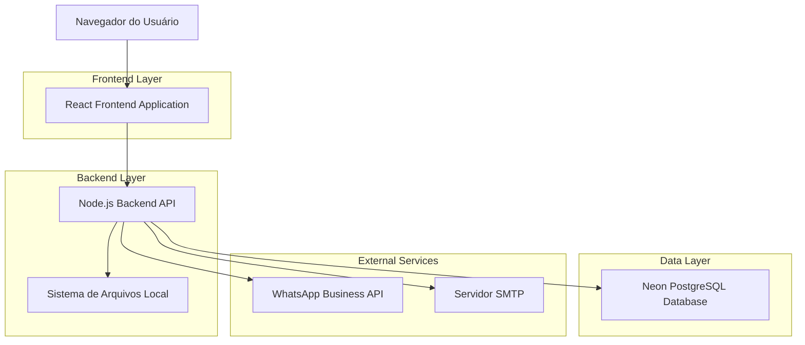
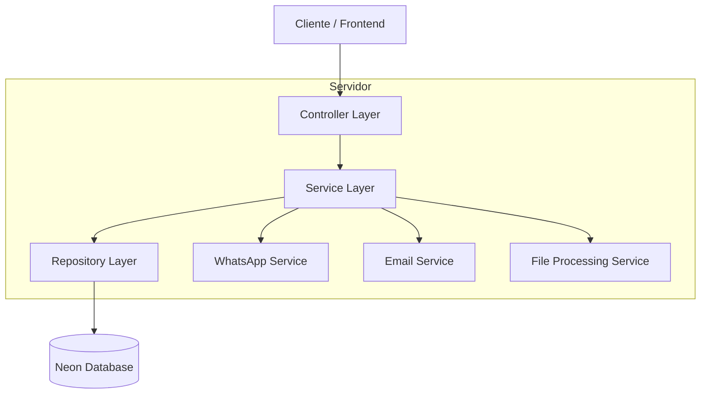
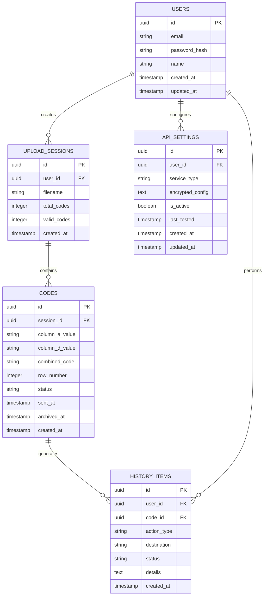

# Arquitetura Técnica - Sistema de Extração de Códigos de Recarga

## 1. Arquitetura do Sistema



## 2. Descrição das Tecnologias

* **Frontend**: React\@18 + TypeScript + Tailwind CSS + Vite

* **Backend**: Node.js\@18 + Express\@4 + TypeScript

* **Database**: Neon (PostgreSQL)

* **Autenticação**: JWT + bcrypt

* **Processamento de Arquivos**: multer + xlsx + csv-parser

* **Integrações**: WhatsApp Business API + Nodemailer

## 3. Definições de Rotas

| Rota           | Propósito                                     |
| -------------- | --------------------------------------------- |
| /              | Página principal com upload e grid de códigos |
| /configuracoes | Página de configurações de APIs e tutoriais   |
| /historico     | Página de histórico de envios e estatísticas  |
| /login         | Página de autenticação do usuário             |

## 4. Definições de APIs

### 4.1 APIs Principais

**Upload e Processamento de Planilhas**

```
POST /api/upload
```

Request:

| Parâmetro | Tipo | Obrigatório | Descrição                   |
| --------- | ---- | ----------- | --------------------------- |
| file      | File | true        | Arquivo Excel (.xlsx, .xls) |

Response:

| Parâmetro    | Tipo   | Descrição                  |
| ------------ | ------ | -------------------------- |
| session\_id  | string | ID da sessão de upload     |
| codes        | array  | Lista de códigos extraídos |
| total\_count | number | Total de códigos válidos   |

**Busca de Códigos**

```
GET /api/codes/:session_id
```

Response:

| Parâmetro  | Tipo   | Descrição                   |
| ---------- | ------ | --------------------------- |
| codes      | array  | Lista de códigos com status |
| pagination | object | Informações de paginação    |

**Envio via WhatsApp**

```
POST /api/send/whatsapp
```

Request:

| Parâmetro     | Tipo   | Obrigatório | Descrição                |
| ------------- | ------ | ----------- | ------------------------ |
| code\_ids     | array  | true        | IDs dos códigos a enviar |
| phone\_number | string | true        | Número do destinatário   |

Response:

| Parâmetro   | Tipo    | Descrição          |
| ----------- | ------- | ------------------ |
| success     | boolean | Status do envio    |
| sent\_count | number  | Quantidade enviada |

**Envio via Email**

```
POST /api/send/email
```

Request:

| Parâmetro | Tipo   | Obrigatório | Descrição                |
| --------- | ------ | ----------- | ------------------------ |
| code\_ids | array  | true        | IDs dos códigos a enviar |
| email     | string | true        | Email do destinatário    |
| subject   | string | false       | Assunto do email         |

### 4.2 APIs de Configuração

**Configuração WhatsApp**

```
POST /api/settings/whatsapp
```

Request:

| Parâmetro         | Tipo   | Obrigatório | Descrição              |
| ----------------- | ------ | ----------- | ---------------------- |
| access\_token     | string | true        | Token de acesso da API |
| phone\_number\_id | string | true        | ID do número WhatsApp  |
| webhook\_url      | string | false       | URL do webhook         |

**Configuração Email**

```
POST /api/settings/email
```

Request:

| Parâmetro      | Tipo    | Obrigatório | Descrição     |
| -------------- | ------- | ----------- | ------------- |
| smtp\_host     | string  | true        | Servidor SMTP |
| smtp\_port     | number  | true        | Porta SMTP    |
| smtp\_user     | string  | true        | Usuário SMTP  |
| smtp\_password | string  | true        | Senha SMTP    |
| use\_ssl       | boolean | false       | Usar SSL/TLS  |

**Teste de Conectividade**

```
POST /api/settings/test/whatsapp
POST /api/settings/test/email
```

### 4.3 APIs de Arquivamento

**Arquivar Códigos**

```
POST /api/codes/archive
```

Request:

| Parâmetro | Tipo  | Obrigatório | Descrição                  |
| --------- | ----- | ----------- | -------------------------- |
| code\_ids | array | true        | IDs dos códigos a arquivar |

**Desarquivar Códigos**

```
POST /api/codes/unarchive
```

**Histórico de Envios**

```
GET /api/history
```

Response:

| Parâmetro  | Tipo   | Descrição                  |
| ---------- | ------ | -------------------------- |
| history    | array  | Lista de envios realizados |
| statistics | object | Estatísticas de uso        |

## 5. Arquitetura do Servidor



## 6. Modelo de Dados

### 6.1 Definição do Modelo de Dados



### 6.2 Linguagem de Definição de Dados (DDL)

**Tabela de Usuários (users)**

```sql
-- Criar tabela
CREATE TABLE users (
    id UUID PRIMARY KEY DEFAULT gen_random_uuid(),
    email VARCHAR(255) UNIQUE NOT NULL,
    password_hash VARCHAR(255) NOT NULL,
    name VARCHAR(100) NOT NULL,
    created_at TIMESTAMP WITH TIME ZONE DEFAULT NOW(),
    updated_at TIMESTAMP WITH TIME ZONE DEFAULT NOW()
);

-- Criar índices
CREATE INDEX idx_users_email ON users(email);
```

**Tabela de Sessões de Upload (upload\_sessions)**

```sql
-- Criar tabela
CREATE TABLE upload_sessions (
    id UUID PRIMARY KEY DEFAULT gen_random_uuid(),
    user_id UUID NOT NULL REFERENCES users(id) ON DELETE CASCADE,
    filename VARCHAR(255) NOT NULL,
    total_codes INTEGER DEFAULT 0,
    valid_codes INTEGER DEFAULT 0,
    created_at TIMESTAMP WITH TIME ZONE DEFAULT NOW()
);

-- Criar índices
CREATE INDEX idx_upload_sessions_user_id ON upload_sessions(user_id);
CREATE INDEX idx_upload_sessions_created_at ON upload_sessions(created_at DESC);
```

**Tabela de Códigos (codes)**

```sql
-- Criar tabela
CREATE TABLE codes (
    id UUID PRIMARY KEY DEFAULT gen_random_uuid(),
    session_id UUID NOT NULL REFERENCES upload_sessions(id) ON DELETE CASCADE,
    column_a_value VARCHAR(255),
    column_d_value VARCHAR(255),
    combined_code VARCHAR(511) NOT NULL,
    row_number INTEGER NOT NULL,
    status VARCHAR(20) DEFAULT 'available' CHECK (status IN ('available', 'sent', 'archived')),
    sent_at TIMESTAMP WITH TIME ZONE,
    archived_at TIMESTAMP WITH TIME ZONE,
    created_at TIMESTAMP WITH TIME ZONE DEFAULT NOW()
);

-- Criar índices
CREATE INDEX idx_codes_session_id ON codes(session_id);
CREATE INDEX idx_codes_status ON codes(status);
CREATE INDEX idx_codes_created_at ON codes(created_at DESC);
```

**Tabela de Histórico (history\_items)**

```sql
-- Criar tabela
CREATE TABLE history_items (
    id UUID PRIMARY KEY DEFAULT gen_random_uuid(),
    user_id UUID NOT NULL REFERENCES users(id) ON DELETE CASCADE,
    code_id UUID REFERENCES codes(id) ON DELETE SET NULL,
    action_type VARCHAR(50) NOT NULL CHECK (action_type IN ('send_whatsapp', 'send_email', 'archive', 'unarchive')),
    destination VARCHAR(255),
    status VARCHAR(20) DEFAULT 'success' CHECK (status IN ('success', 'failed', 'pending')),
    details TEXT,
    created_at TIMESTAMP WITH TIME ZONE DEFAULT NOW()
);

-- Criar índices
CREATE INDEX idx_history_user_id ON history_items(user_id);
CREATE INDEX idx_history_created_at ON history_items(created_at DESC);
CREATE INDEX idx_history_action_type ON history_items(action_type);
```

**Tabela de Configurações de API (api\_settings)**

```sql
-- Criar tabela
CREATE TABLE api_settings (
    id UUID PRIMARY KEY DEFAULT gen_random_uuid(),
    user_id UUID NOT NULL REFERENCES users(id) ON DELETE CASCADE,
    service_type VARCHAR(20) NOT NULL CHECK (service_type IN ('whatsapp', 'email')),
    encrypted_config TEXT NOT NULL,
    is_active BOOLEAN DEFAULT true,
    last_tested TIMESTAMP WITH TIME ZONE,
    created_at TIMESTAMP WITH TIME ZONE DEFAULT NOW(),
    updated_at TIMESTAMP WITH TIME ZONE DEFAULT NOW(),
    UNIQUE(user_id, service_type)
);

-- Criar índices
CREATE INDEX idx_api_settings_user_service ON api_settings(user_id, service_type);
```

**Dados Iniciais**

```sql
-- Usuário de exemplo para desenvolvimento
INSERT INTO users (email, password_hash, name) VALUES 
('admin@exemplo.com', '$2b$10$exemplo_hash', 'Administrador');
```

