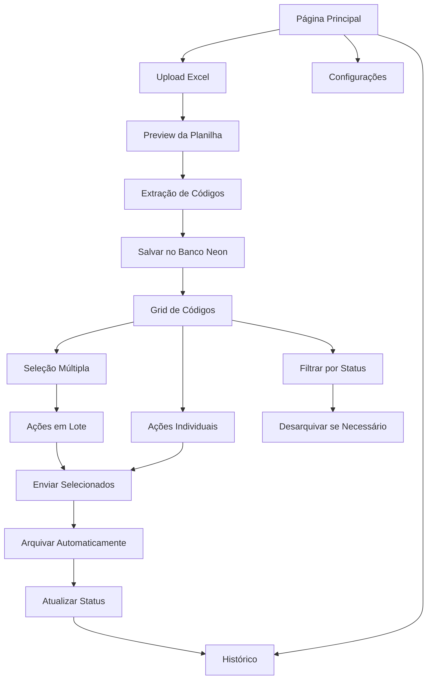

# Sistema de Extração de Códigos de Recarga

## 1. Product Overview
Sistema web para extração e gerenciamento de códigos de recarga a partir de planilhas Excel, permitindo upload, processamento automático e distribuição via WhatsApp e Email.
- Soluciona o problema de processamento manual de códigos de recarga em planilhas, automatizando a extração e distribuição.
- Destinado a operadores de telecomunicações e empresas que trabalham com códigos de recarga em massa.

## 2. Core Features

### 2.1 Feature Module
Nosso sistema de códigos de recarga consiste nas seguintes páginas principais:
1. **Página Principal**: área de upload, preview da planilha, lista de códigos extraídos.
2. **Página de Configurações**: personalização do formato de saída, configurações de integração.
3. **Página de Histórico**: histórico de códigos copiados e enviados.

### 2.2 Page Details

| Page Name | Module Name | Feature description |
|-----------|-------------|---------------------|
| Página Principal | Área de Upload | Upload de arquivos Excel (.xlsx/.xls) via drag & drop ou seleção manual |
| Página Principal | Preview da Planilha | Visualização prévia dos dados antes da extração |
| Página Principal | Extração de Dados | Extração automática das colunas A e D a partir da linha 3 |
| Página Principal | Grid de Códigos | Grid responsiva com checkboxes, código, botões de ação e indicadores de status (verde=disponível, amarelo=enviado, cinza=arquivado) |
| Página Principal | Ações por Código | Botões individuais para copiar, enviar WhatsApp e Email |
| Página Principal | Ações em Lote | Seleção múltipla e ações em massa (enviar/arquivar) |
| Página Principal | Sistema de Arquivamento | Arquivar códigos enviados para evitar reenvios acidentais |
| Página Principal | Controle de Status | Indicadores visuais de status (disponível/enviado/arquivado) |
| Página Principal | Filtros e Busca | Filtrar e buscar códigos na lista |
| Página Principal | Contador | Exibição do número total de códigos extraídos |
| Página de Configurações | Formato de Saída | Personalização do formato dos códigos (ex: "A3 - D3") |
| Página de Configurações | Configuração WhatsApp | Campos para token, número, webhook da API do WhatsApp Business |
| Página de Configurações | Configuração Email | Campos para servidor SMTP, porta, usuário, senha e autenticação |
| Página de Configurações | Tutoriais Integrados | Guias passo-a-passo para obter credenciais das APIs |
| Página de Configurações | Teste de Conectividade | Botões para validar e testar conexões com WhatsApp e Email |
| Página de Configurações | Gerenciamento de Credenciais | Armazenamento seguro e criptografado das configurações |
| Página de Histórico | Histórico de Códigos | Lista de códigos copiados e enviados com timestamps |
| Página de Histórico | Estatísticas | Métricas de uso e performance |

## 3. Core Process

**Fluxo Principal do Usuário:**
1. Usuário acessa a página principal
2. Faz upload da planilha Excel via drag & drop ou botão
3. Sistema valida o arquivo e exibe preview
4. Usuário confirma a extração
5. Sistema processa e salva códigos no banco Neon
6. Códigos são exibidos em grid com checkboxes para seleção
7. Usuário seleciona códigos desejados no grid
8. Usuário pode enviar códigos selecionados via WhatsApp ou Email
9. Sistema arquiva automaticamente códigos enviados
10. Códigos arquivados ficam disponíveis para reenvio se necessário
11. Sistema registra todas as ações no histórico

## 4. User Interface Design

### 4.1 Design Style
- **Cores primárias**: Azul (#2563eb) e Verde (#16a34a) para ações positivas
- **Cores secundárias**: Cinza (#6b7280) para textos e Vermelho (#dc2626) para alertas
- **Estilo de botões**: Arredondados com sombra sutil
- **Fonte**: Inter ou system fonts, tamanhos 14px (corpo) e 16px (títulos)
- **Layout**: Design baseado em cards com navegação superior
- **Ícones**: Lucide React icons para consistência

### 4.2 Page Design Overview

| Page Name | Module Name | UI Elements |
|-----------|-------------|-------------|
| Página Principal | Área de Upload | Card central com ícone de upload, texto "Arraste seu arquivo Excel aqui" e botão secundário |
| Página Principal | Preview da Planilha | Tabela responsiva com scroll horizontal, cabeçalhos destacados |
| Página Principal | Lista de Códigos | Grid de cards com código, botões de ação e status visual |
| Página Principal | Filtros e Busca | Barra de busca no topo com filtros dropdown |
| Página de Configurações | Formato de Saída | Input text com preview em tempo real |
| Página de Configurações | Configuração WhatsApp | Cards com campos de entrada, botões de teste e status de conexão |
| Página de Configurações | Configuração Email | Formulário SMTP com validação e teste de envio |
| Página de Configurações | Tutoriais | Seções expansíveis com guias ilustrados e links úteis |
| Página de Histórico | Histórico de Códigos | Tabela com paginação e filtros por data |

### 4.3 Responsiveness
Design mobile-first com breakpoints para tablet (768px) e desktop (1024px). Otimizado para touch com botões de tamanho adequado (44px mínimo) e gestos de swipe para ações rápidas em dispositivos móveis.