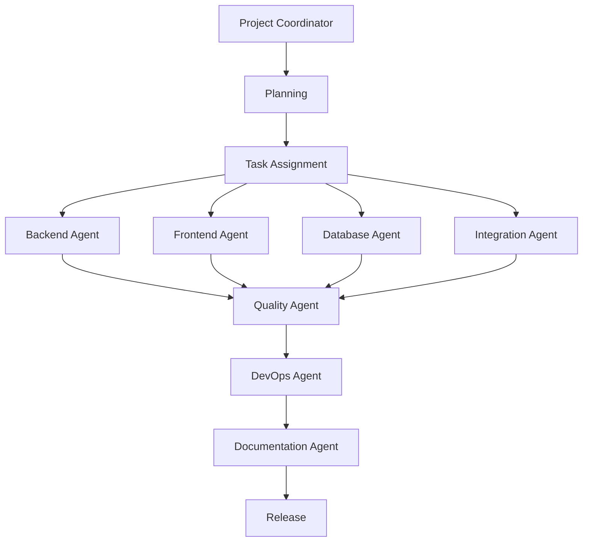

# Equipe de Agentes - EnviaCodigo

Esta pasta contém a documentação da equipe de agentes especializados para trabalhar no projeto EnviaCodigo. Cada agente tem responsabilidades específicas e expertise técnica para diferentes aspectos do desenvolvimento.

## Estrutura da Equipe

### 🎯 [Project Coordinator](./ProjectCoordinator.md)
**Líder da equipe** - Coordenação geral, planejamento e comunicação entre agentes
- Planejamento de sprints e roadmap
- Priorização de tarefas
- Risk management
- Comunicação com stakeholders

### 🔧 [Backend Agent](./BackendAgent.md)
**API e Servidor** - Desenvolvimento da API Express.js e lógica de negócio
- Controllers, services e repositories
- Autenticação JWT
- Integração com banco de dados
- Processamento de arquivos

### 🎨 [Frontend Agent](./FrontendAgent.md)
**Interface de Usuário** - Desenvolvimento React com TypeScript
- Componentes reutilizáveis
- Estado global e local
- Integração com APIs
- Design responsivo

### 🗄️ [Database Agent](./DatabaseAgent.md)
**Banco de Dados** - Gerenciamento de dados e otimização
- Schema design
- Query optimization
- Migração SQLite/PostgreSQL
- Backup e recovery

### 🧪 [Quality Agent](./QualityAgent.md)
**Testes e Qualidade** - Garantia de qualidade e testes automatizados
- Testes unitários e integração
- Code review
- Análise estática
- Security audits

### 🔌 [Integration Agent](./IntegrationAgent.md)
**APIs Externas** - Integrações com WhatsApp, Email e outros serviços
- WhatsApp Business API
- SMTP configuration
- Webhooks
- Rate limiting

### 🚀 [DevOps Agent](./DevOpsAgent.md)
**Deploy e Infraestrutura** - Configuração de ambientes e deploy
- CI/CD pipelines
- Vercel deployment
- Monitoring
- Performance optimization

### 📚 [Documentation Agent](./DocumentationAgent.md)
**Documentação** - Criação e manutenção de documentação técnica
- API documentation
- User guides
- Architecture docs
- Tutorials

## Como Usar os Agentes

### Para Novas Funcionalidades
1. **Project Coordinator** avalia e planeja a funcionalidade
2. Distribui tarefas para agentes relevantes:
   - **Backend Agent** para APIs
   - **Frontend Agent** para interface
   - **Database Agent** para mudanças no schema
   - **Integration Agent** para APIs externas
3. **Quality Agent** revisa e testa
4. **DevOps Agent** faz deploy
5. **Documentation Agent** documenta

### Para Correções de Bugs
1. **Project Coordinator** prioriza e atribui
2. Agente especializado corrige o problema
3. **Quality Agent** valida a correção
4. **DevOps Agent** faz deploy hotfix se necessário

### Para Melhorias de Performance
1. **Database Agent** otimiza queries
2. **Backend Agent** otimiza APIs
3. **Frontend Agent** otimiza componentes
4. **DevOps Agent** otimiza infraestrutura

## Workflow de Colaboração

## Comunicação Entre Agentes

- **Daily Standups:** Coordenação diária via Project Coordinator
- **Code Reviews:** Quality Agent revisa código de todos os agentes
- **Documentation:** Documentation Agent mantém docs atualizadas
- **Releases:** DevOps Agent coordena deploys com todos os agentes

## Expertise por Área

| Área | Agente Principal | Agentes de Apoio |
|------|------------------|------------------|
| API Development | Backend Agent | Quality, Integration |
| UI/UX | Frontend Agent | Quality, Documentation |
| Data Management | Database Agent | Backend, DevOps |
| External APIs | Integration Agent | Backend, Quality |
| Deployment | DevOps Agent | Quality, Backend |
| Quality Assurance | Quality Agent | Todos |
| Documentation | Documentation Agent | Todos |
| Project Management | Project Coordinator | Todos |

## Getting Started

1. Leia o [CLAUDE.md](../CLAUDE.md) para entender a arquitetura geral
2. Identifique o agente responsável pela sua tarefa
3. Consulte a documentação específica do agente
4. Execute os comandos necessários
5. Comunique progresso ao Project Coordinator